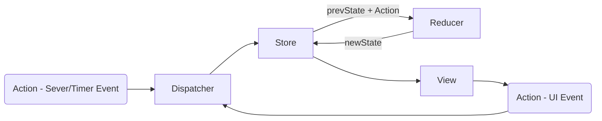

This project was bootstrapped with [Create React App](https://github.com/facebookincubator/create-react-app).

Deleted the contents of

- public
- src

Recreate public/index.html and src/index.js

## Table of Contents

- [JSX Javascript XML](#jsx)
- [Styling](#styling)
- [React State](#react-state)
- [Events](#events)
- [Lifecycle Events](#lifecycle-events)
- [Validating Props](#validating-props)
- [Key](#key)
- [Component Types](#component-types)
- [React Router](#react-router)
- [Redux](#redux)
- [react-redux](#react-redux)
- [Middleware](#middleware)
- [Integrating API](#integrating-api)
- [Webpack](#webpack)
- [Unit testing](#unit-testing)

## JSX

Javascript XML Follows the rules of XML

- Single Parent root element
- tags should be properly close
- case-sensitive
- proper nesting of tags
- attribute values must be enclose within quotes(single or double)
- attribute values other than string can be passed as expressions (Ecample: <Hello val={100}>)
- html attribute names must be camel case (example: class as className, onclick as onClick)
  #JSX Expression
- _IF and FOR cannot be used inside the JSX (<Hello>{ no if or for loop }<//Hello>). However, conditional expression(?:) is allowed._

## Styling

- Inline style should be only objects unlike html string
- style attribute value in html { color: "red"; font-size: 30;} has to converted to equivalent object in jsx as {color: "red", fontSize: 30}
- External or Internal CSS as be utilized

## React State

- Makes the page dynamic in response to either time or user event or server rendering or ajax calls.
- Do NOT modify props
- State is immuetable, use setState() to modify the state
- States can be used only with Class components. Function components would not handle state and use only props.
  _Interactions_
  - Parent to Child is the only way to interact, i.e no child to parent or siblings interactions. But it can be achieved through design patterns.
    Refer 2a_Events

## Events

- Events are sythesized events, doesn't interact with real DOM
- Event params are accessed with target (like ev.target.value or ev.target.checked)

## Lifecycle Events

Refer 3_Lifecycle

1.  Mounting Phase
2.  Updating Phase
    a. State Changes
    b. Property Changes
    c. Parent Updates
3.  Unmounting Phase

|      | Mounting Phase     | Update Phase              | Unmounting Phase     |
| ---- | ------------------ | ------------------------- | -------------------- |
|      | contructor         |                           |                      |
|      |                    | componentWillReceiveProps |                      |
|      |                    | shouldComponentUpdate     |                      |
| WILL | componentWillMount | componentWillUpdate       | componentWillUnmount |
|      | render             | render                    |                      |
| DID  | componentDidMount  | componentDidUpdate        |                      |

## Validating Props

Good practice to validate props. A warning will be shown only in the development mode.

> npm install --save prop-types

[prop-types](https://www.npmjs.com/package/prop-types)

## Key

- Key ensures that diffing and Reconciliation takes place in an efficient manner.
- Key should be unique
- Elements generated in a iteration should have key
  _Usual approach_

> <ul\>
> <li\>red</li\>
> <li\>green</li\>
> </ul\>

_Good approach_

> <ul\> > \<li key="red"\>red</li\> > \<li key="green"\>green</li\> > \<li key="blue"\>blue</li\> > \</ul\>

## Component Types

1.  Controlled Components (Two way binding)

- Values are binded with State with handlers on each of the control
- Two way binding, i.e the values/changes are written back to the html controls and also maintained by the react's state

2.  Uncontrolled Components (One way binding)

- Usage of 'ref' attribute to the components
  > <input type='text' ref={ node=>{
  > this.instancevariable = node; } }\/>
- when using ref you cannot use 'value' attribute
- One way binding, i.e control changes are binded only on one action of the form

## React Router

> npm install --save react-router-dom

-"exact" does a exact match with the Link to -> Route path
BrowserRouter in index.js has to wrapped root component which has Link or NavLik and Route components

-Use HashRouter, only when it is a static content loading other wise the recommendation is to use BrowserRouter which could help server get the access log

_Redirect and Prompt_

> Refer 7a_ReactRouter

_Route Params_

> <Route path="//aboutus//:id" component={AboutUs} //>

It can be access via this.props.params

_Passing attribute to Components called in Route_

> Refer 7b_ReactRouter

\<Route
path="/get/:id"
render={() => {
const Temp = withRouter(GetInfo);
return <Temp attr1="test" \/>;
}}
\/>

- Use withRouter, if you want to pass attributes to the components via the route

## Redux

1.  Immutability
    Do not modify the inputs. Manipulate on the copy of input.
    reducer
2.  Pure Functions
    Don't use global variable
    No Input/output
    Don't make DB/API Calls
    Don't Mutate object params

FLUX Patterns

1.  Create a View
2.  Design Actions and State
3.  Create Reducer - with default state and handle actions and always returns a state
4.  Create a Store( Initialize )
5.  Create Actions - with store dispatcher
    a. Bind the actions to view - say onclick of button, invoke the action function to dispatch to store
6.  Binding View to Show the Store Values
    a. Use the store subscribe(), which is called whenever the store changes
    b. access the store objects via getState()

## react-redux

_Development Steps_

1.  Create HTML/ CSS /JS for Static View
2.  Break Views into Components (Design a react DOM)
3.  Convert Static HTML to React Static page
4.  Design a Redux Store and Actions
5.  Create Reducers
6.  Create Store(inititalize), then test with Redux dev tools
7.  Create Actions creators
8.  Dispatch Actions from View
9.  Binding (subscribe) View to Store changes

_Redux_

> npm install --save redux

1.  import createStore from Redux

_react-redux_
Store to View and View To Action binding is done by react-redux

> npm install --save react-redux

1.  import Provider
2.  import 'connect' and the component with connect and export the connected component know as container

Detailed Steps to follow:

> Refer 8_ReactRedux

1.  Create View (Plain views)
    a. components/App.js
    b. components/Form.js
    c. components/Display.js
2.  Design Action and State
    - state : {count: 0}
    - Actions
      a. {type: "INCREMENT"}
      b. {type: "DECREMENT"}
3.  Create Reducer
    a. reducers/counterReducer.js
    b. add the reducer function and action based manipulation to return the new state
4.  Create Store(initialize)
    a. in index.js, create a store by initializing with the reducer function as parameter
    b. import Provider component and wrap the App component. In addition pass the attribute store with the initialized store
5.  Create Actions
    a. In actions/counterActions.js, create a function to return action type
6.  Dispatch Actions from View
    a. import connect and form a connected component as container for Form.js
    b. once connected, action handlers would have the dispach prop type
    b. on logging the 'this', you could find the 'dispach' object, to which you can pass the action handler (types of action - based on which the reducer would behave)
7.  Binding View to Store
    a. import connect and form a connected component as container for Display.js
    b. create a mapStateToProps(state, ownProps) to handle and accept the state from Redux Store and pass the state as props to the Display component

_Code Refactor_

> Refer 8a_ReactRedux

1.  Create a container directory and attempt make the components pure
2.  Move the mapStateToProps and create mapDispatchToProps - and move the handlers to the container
3.  use connect to bind mapStateToProps, mapDispatchToProps with the component

> Intall redux devtools chrome extension
> install redux-devtools-extension --save-dev

_Combine Reducers_

> Refer 8b_ReactRedux

If there are multiple reducers, it can be combined

## Middleware

_Custom Middleware_

applyMiddleware is used to bind middleware.

> Refer 9_Middleware

## Integrating API

> Refer 10_Middleware

To handle async in redux, use redux-thunk

> npm install redux-thunk --save

> npm install axios --save

1.  axios is used to hit the api to get response data
2.  userDetailsAction gets just url as parameter and returns a plain object ({type:"IS_FETCHING"}).
3.  On applying redux-thunk as middleware, the userDetailsAction becomes capable of handling async callbacks that could return function with two parametersi.e (dipatch, state)

## Webpack

_Why ?_

1.  Automatic browser launch
2.  files hosted on Web server
3.  hot reload
4.  JS & CSS bundles are created on build
5.  merged multiple CSS and JS into single files
6.  added link of bundle css/js to index.html
7.  minification
8.  Able to import CSS inside JS
9.  Babel transpilation

> npm install webpack save-dev

1.  in package.json add a 'bulid' inside script object.

- two params, one the root path of source and other the destination of bundle

  > script: "webpack src/index.js public/index.js"

2.  Configuration can be maintained as js
    webpack.config.js
    This file should be in the root path (that is same as package.json path)
    if this config file is avalable, just configure package.json with script:{"build": "webpack"}
    Refer : https://webpack.js.org/configuration/

- entry
- output
- module - rules:[test (regex of what to include) , exlude (directory), use : {loader: (like babel)}]

> Refer: repo:\basic\ReactJS_Training_Material\12_Package_and_Build\01_Webpack

3.  for react add bable.rc / option with [react] in additon to bable presets [es2015]
4.  hot reload - use watch option
5.  Webpack dev server by adding 'devServer' option
    refer basic\ReactJS_Training_Material\12_Package_and_Build\01_Webpack\050_LiveReloading\Code\webpack2
6.  For loading css into JS and hot css reloadiong, add loader in config like 'css-loader' and 'style-loader' respectively. Good for development mode, so use ExtractTextPlugin for building a prod.
7.  Hot module replacement, preserves the state whereas hot reloading the state is lost
    devServer: {
    contentBase: path.join(\_\_dirname, 'public'),
    compress: true,
    port: 8080,
    open: true,
    hot: true
    },
    plugins: [new webpack.HotModuleReplacementPlugin()]

this has to be added in index.js and helps in debugging
if (module.hot) {
module.hot.accept();
}

8.  always deploy 'source-map' helps in debugging
    > browser setting->enable javascript sourcemap and reload browser

## Unit testing

- Jest, both test runner and assersion
- test library : react-test-renderer and Enzyme
  \_\_tests\_\_ directory or .spect.js or .test.js
- TTD is not possible
- regression testing is achieved through snapshot testing that is supported by jest
